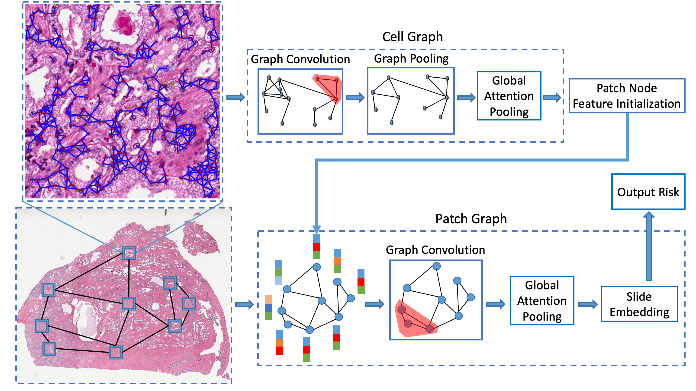

# Hierarchical Graph Pathomic Network for Progression Free Survival Prediction

### Authors: Zichen Wang, Jiayun Li, Zhufeng Pan, Wenyuan Li, Anthony Sisk, Huihui Ye, William Speier, and Corey W. Arnold

### Introduction
This repository is the Pytorch implementation of our MICCAI 2021 paper 
'Hierarchical graph pathomic network for progression free survival prediction'.

Hierarchical graph pathomic network is a deep learning framework that leverages hierarchical graph-based representations to enable more precise prediction of progression-free survival. Unlike conventional approaches that analyze patch-based or cell-based pathomic features alone without considering their spatial connectivity, we explore multi-scale topological structures of whole slide images in an integrative contex.

### Questions

Please send any questions you might have about this repository to <zcwang0702@ucla.edu>